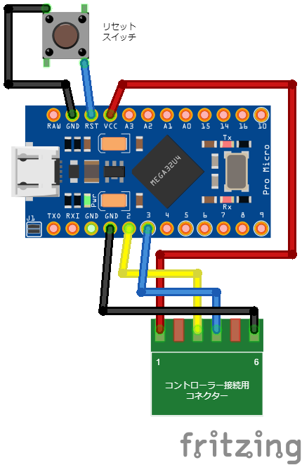

# CLV-202 to USB

CLV-202 to USB はニンテンドークラシックミニ スーパーファミコンのコントローラー(CLV-202)を USB ゲームパッドとして扱えるようにする。

[CLV-202 to USB](https://kkawahara.net/development/clv-202-to-usb)

## ハードウェアの配線図



## 書き込み方法

### ライブラリをインストールする

以下のリポジトリをクローンする。

[GitHub - dmadison/ArduinoXInput_AVR: AVR boards package for the ArduinoXInput project](https://github.com/dmadison/ArduinoXInput_AVR)

[GitHub - dmadison/ArduinoXInput_Sparkfun: SparkFun boards package for the ArduinoXInput project](https://github.com/dmadison/ArduinoXInput_SparkFun)

Windows 環境の場合、クローンしたファイル群を以下のように置き直す。バージョンなど足りないディレクトリは手動で作成する。

```
%LOCALAPPDATA%\Arduino15
└─packages
    ├─arduino
    ├─builtin
    ├─xinput
    │  └─hardware
    │      └─avr
    │          └─1.0.5
    │              │  boards.txt
    │              │  LICENSE
    │              │  platform.txt
    │              │  post_install.bat
    │              │  README.md
    │              │
    │              ├─.github
    │              ├─bootloaders
    │              ├─cores
    │              ├─drivers
    │              ├─libraries
    │              └─variants
    └─xinput_sparkfun
        └─hardware
            └─avr
                └─1.0.0
                    │  avrdude.conf
                    │  boards.txt
                    │  platform.txt
                    │
                    ├─bootloaders
                    ├─libraries
                    └─variants
```

次に `ツール`-`ライブラリの管理...`から XInput をインストールする。

Arduino IDE を再起動する。

以下のようにソフトウェアを書き込む。

1. マイコンを USB 接続する。
1. リセットスイッチをダブルクリックすると COM ポートが出現するので、**素早く** Arduino IDE の`ツール`-`シリアルポート`から COM ポートを設定する。
1. Arduino IDE の書き込みボタンを押す。
1. Arduino IDE の`コンパイル完了。`のトーストが出現したあたりで、リセットスイッチをダブルクリックし、マイコンに書き込みを受付させる。

うまくいけば Arduino IDE に`書き込み完了`と表示される。
